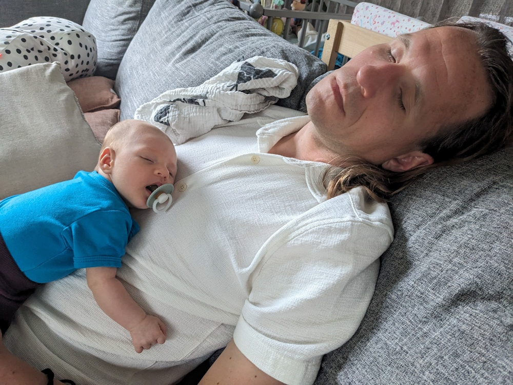

<!-- .slide: class="is-fancy3" -->

### 🙋‍♂️ I'm Nico

 <!-- .element class="img-round" style="width: 400px" -->

- 👪 A Dad ??!!
- 💼 Manager Kenniscentrum
- 👽 StrykerJS maintainer
- 🏊‍♂️ Love to swim and run
- ✨ Front end enthusiast

<!-- .element class="no-list" -->

<i class="bi bi-github" style="color: #fff"></i> <a target="_blank" href="https://github.com/nicojs" style="color: #fff">nicojs</a>  <i class="bi bi-twitter-x" style="margin-left: 20px; color: #fff"></i> <a target="_blank" style="color: #fff" href="https://twitter.com/_nicojs">\_nicojs</a> <i style="margin-left: 20px;" class="bi bi-slack"></i> nicojs

<footer>

https://github.com/nicojs/presentations/tree/master/isks-2024-transition-api

</footer>