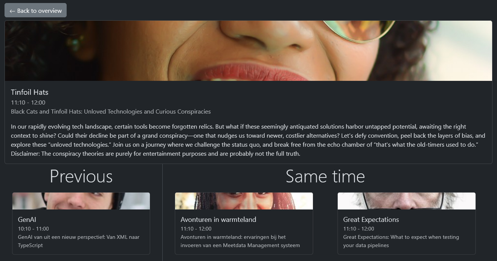

<!-- .slide: data-background-image="../../img/slides/css.avif" -->

---

### Demo

<!-- .slide: class="is-lab" -->

Slide from bottom to top

```css
::view-transition-old(root) {
  animation: 0.4s ease-in both move-out;
}
::view-transition-new(root) {
  animation: 0.4s ease-in both move-in;
}
```

---

### `view-transition-name`

<div class="kc-columns kc-gap1">
<div>

Separate out screenshots to be captured and animated separately

```css
#header {
  view-transition-name: header;
}
```

<!-- .element class="fragment" -->

</div>
<div class="fragment">




</div>
