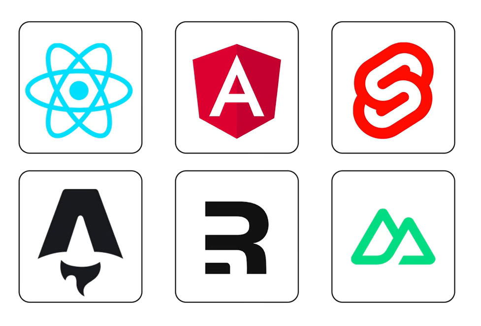

## SPA mode

Single page apps are also supported

```ts
async function clientSideRoute(path: string) {
  const data = await fetchDataForPage(path);

  if (!document.startViewTransition) {
    await updateDOM(path, data);
  }

  document.startViewTransition(() => updateDOM(path, data));
}
```

---

## Framework support

 <!-- .element style="height: 400px" -->


