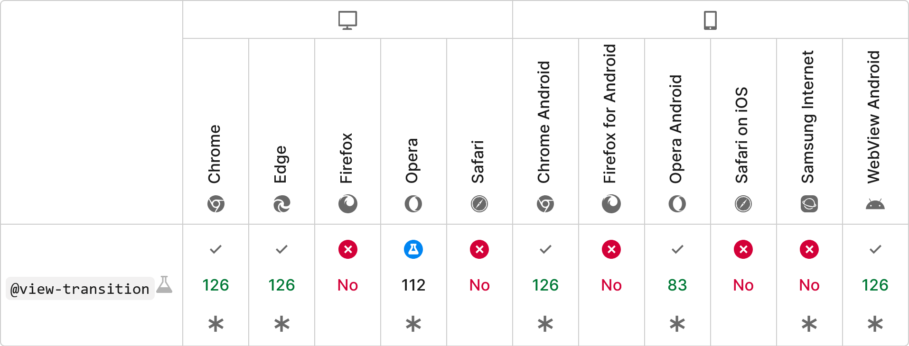

## Limitations

<!-- .slide: class="is-module" data-auto-animate -->

---

<!-- .slide: data-auto-animate -->

## Limitations

Browser support!



---

## Performance

- It will be slower than no animations
  - You can battle that with `speculationrules` api
    ```html
    <script type="speculationrules">
      {
        "prerender": [
          {
            "where": {
              "href_matches": "/*"
            }
          }
        ]
      }
    </script>
    ```

... which is also experimental 