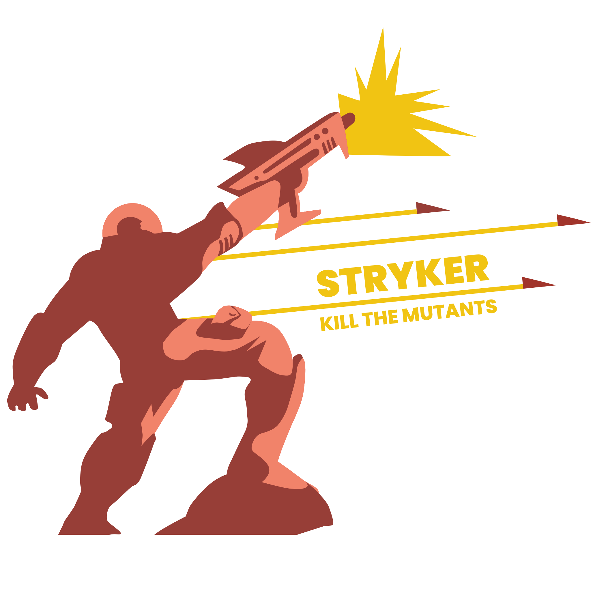

<!-- .slide: class="is-fancy3" data-background-gradient="linear-gradient(90deg, rgba(232,75,57,1) 50%, rgba(0,56,101,1) 50%)" style="color: white" -->

 <!-- .element: width="80%" -->

**Mutation testing framework**\
for JS/TS, C#, Scala, ~~Kotlin~~

stryker-mutator.io

 <!-- .element: width="70%" -->

> Interested in doing your Master Thesis on mutation testing? Talk to us afterwards!

research.infosupport.com

