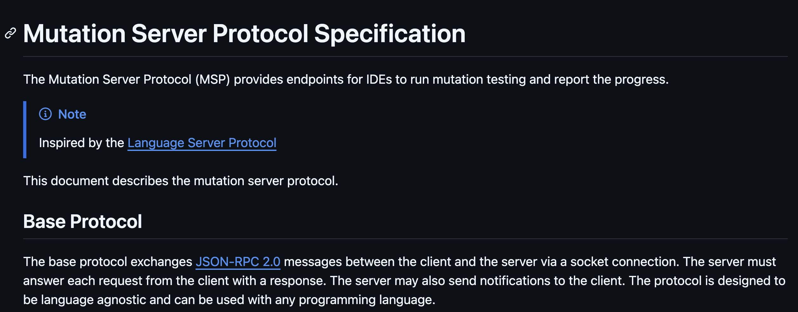

#### Which editor?

- IntelliJ
- VS Code
- NeoVim
- ...

##### Mutation server protocol (MSP)

#### Which framework?

- Stryker.NET?
- StrykerJS?
- PITest?
- ...

---

 <!-- .element target="_blank" -->