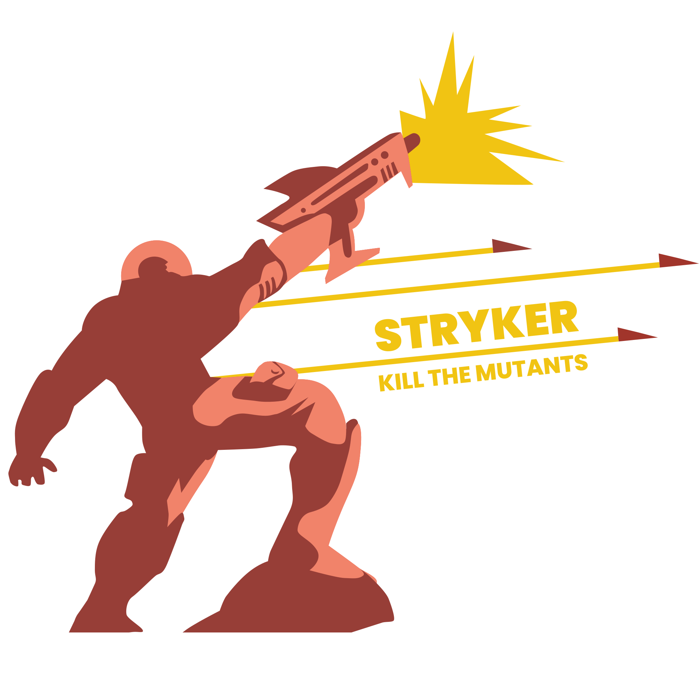

<!-- .slide: class="is-fancy3" data-background-gradient="linear-gradient(90deg, rgba(232,75,57,1) 50%, rgba(0,56,101,1) 50%)" style="color: white" -->

 <!-- .element: width="80%" -->

**Mutation testing framework**\
for JS/TS, C#, Scala, ~~Kotlin~~

[stryker-mutator.io](https://stryker-mutator.io)

 <!-- .element: width="70%" -->

**Master Thesis on mutation testing?** \
<small>(Other subjects are available)</small>

[research.infosupport.com](https://research.infosupport.com)\
[carriere.infosupport.com](https://carriere.infosupport.com)

