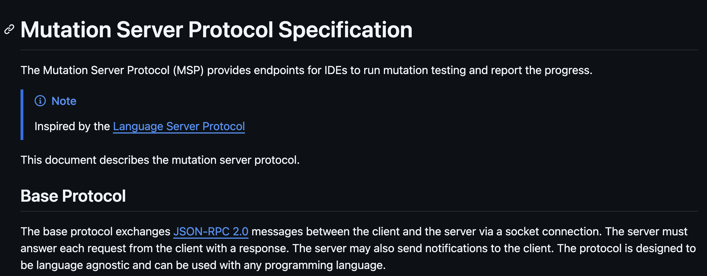

#### Which editor?

- IntelliJ
- VS Code
- NeoVim
- ...

##### Mutation server protocol (MSP)

#### Which framework?

- Stryker.NET?
- StrykerJS?
- PITest?
- ...

notes:

To solve this, we created the Mutation Server Protocol

---

 <!-- .element target="_blank" -->

notes:

The Mutation Server Protocol (MSP) is inspired by the Language Server Protocol (LSP), and uses JSON-RPC 2.0.

Using this protocol, *any* mutation testing library can use our Editor Plugin!